# AI & Robotics Summer Workshop

A modern, responsive workshop landing page built with **React, TypeScript, Tailwind CSS, Express.js, and MongoDB**.

This project was created as part of a Frontend + Backend assessment and showcases a complete workshop registration flow, from a polished user interface to a functional backend API.
## Live link : (https://kidrove-workshop-frontend.onrender.com)
---

## 🚀 Features

### Frontend

* Responsive modern UI
* Hero section with AI & Robotics themed artwork
* Workshop details section
* Learning outcomes section
* FAQ section
* Registration form
* Smooth animations using Framer Motion
* Mobile-friendly design
* Tailwind CSS styling
* TypeScript support

### Backend

* Express.js REST API
* Input validation using Zod
* MongoDB integration using Mongoose
* Error handling
* Health check endpoint
* Local JSON fallback storage if MongoDB is unavailable

---
## Homepage

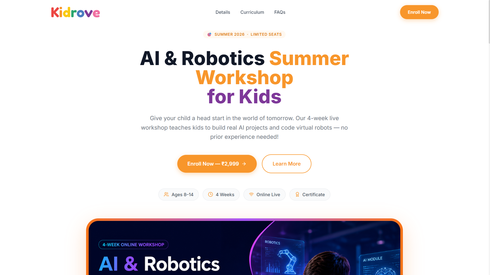

## Workshop Details

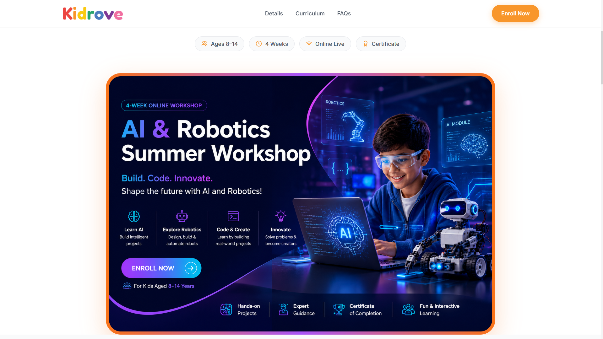
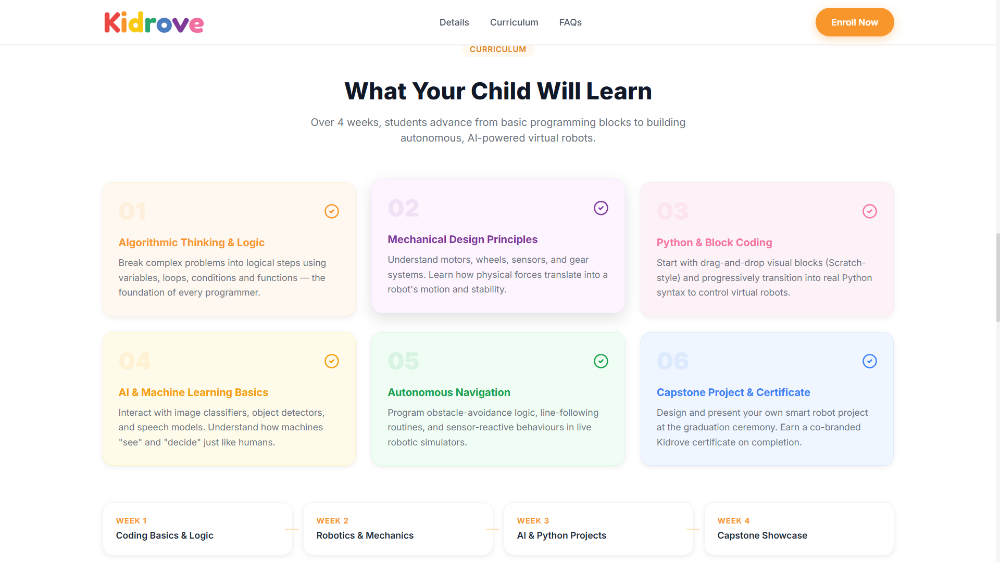
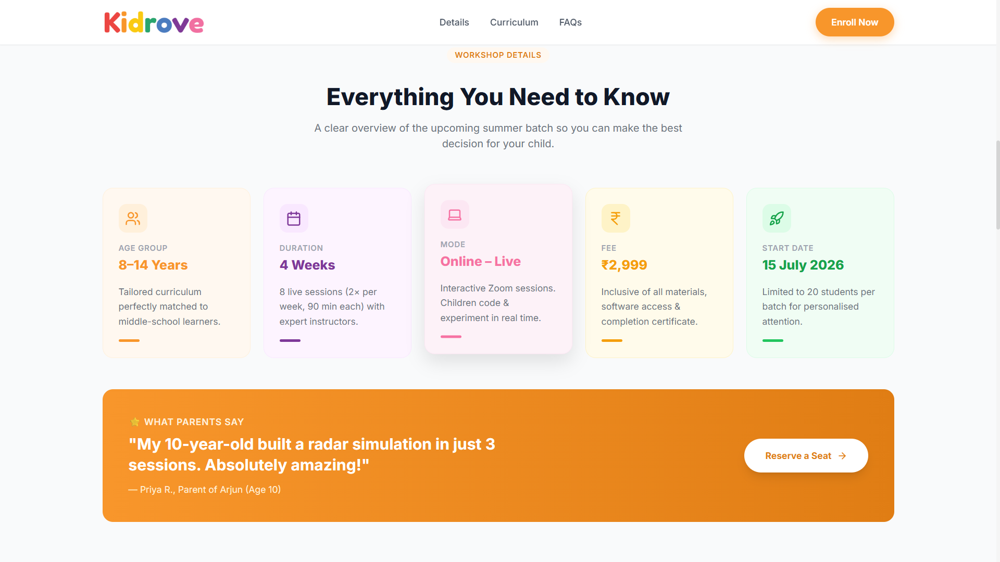

## FAQ Section

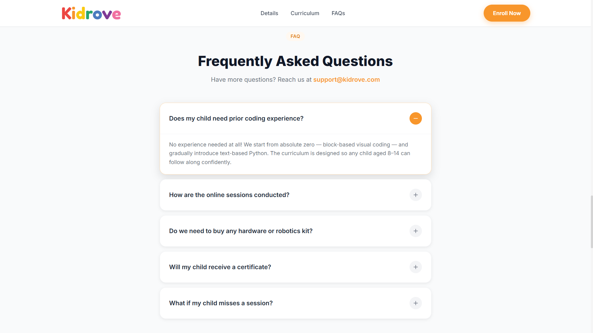

##  Registration Form
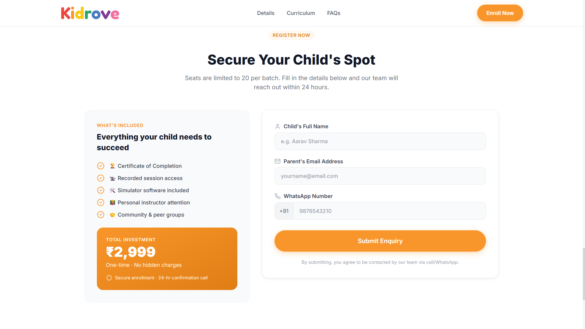

## Confirmation 
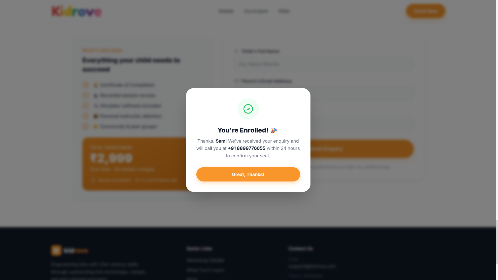

## Footer 
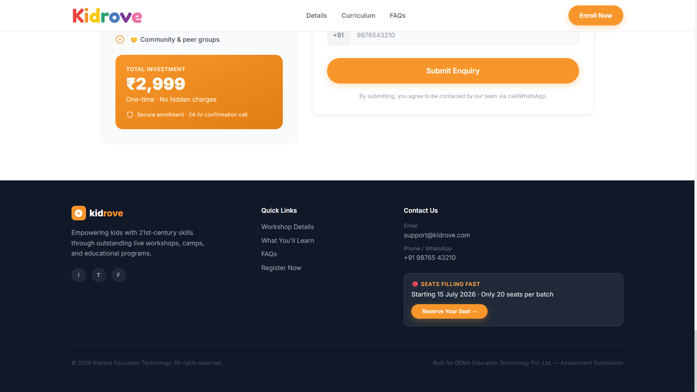

## MongoDb records
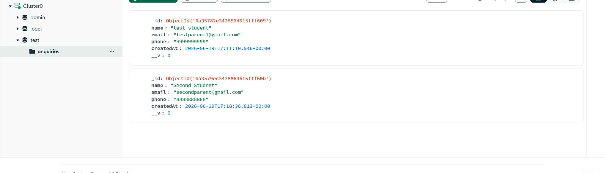

## Mobile view (Responsiveness)
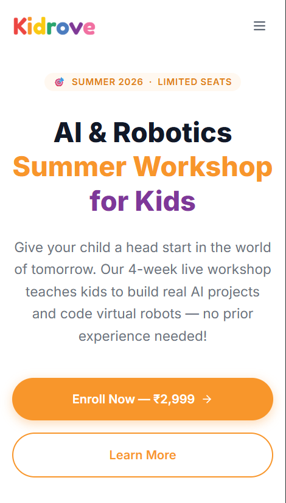
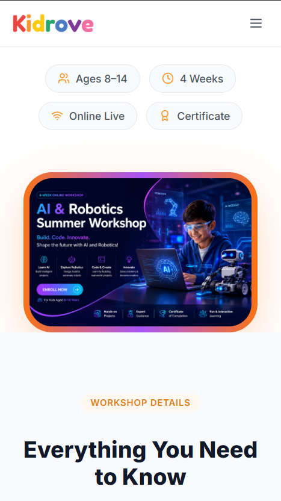
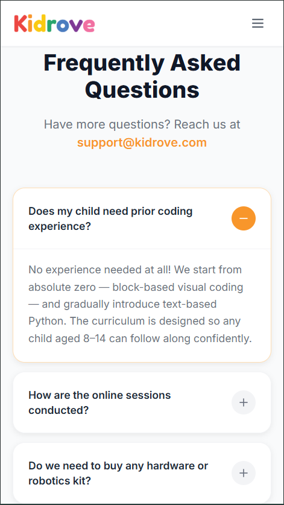
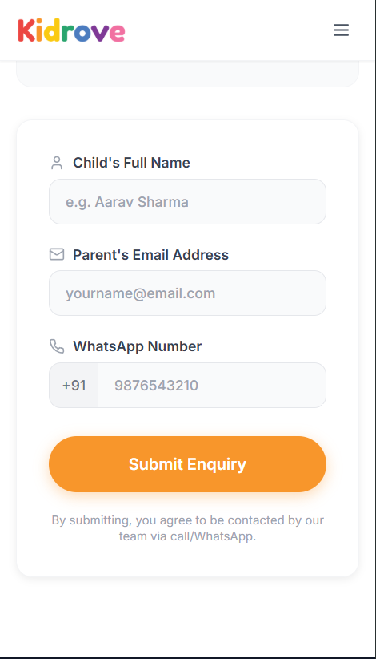


## 📋 Workshop Information

| Field      | Value                         |
| ---------- | ----------------------------- |
| Workshop   | AI & Robotics Summer Workshop |
| Age Group  | 8–14 Years                    |
| Duration   | 4 Weeks                       |
| Mode       | Online                        |
| Fee        | ₹2,999                        |
| Start Date | 15 July 2026                  |

---


---

## 🛠 Tech Stack

### Frontend

* React
* TypeScript
* Tailwind CSS
* Framer Motion
* Vite

### Backend

* Node.js
* Express.js
* MongoDB Atlas
* Mongoose
* Zod

---

## 📂 Project Structure

```text
project-root/
│
├── public/
│   └── images/
│
├── src/
│   ├── components/
│   ├── pages/
│   └── App.tsx
│
├── server/
│   ├── src/
│   │   ├── models/
│   │   ├── db.ts
│   │   └── server.ts
│   │
│   ├── data/
│   ├── package.json
│   └── tsconfig.json
│
└── README.md
```

---

## ⚙️ Installation

### Clone Repository

```bash
git clone <repository-url>
cd kidrove-workshop
```

### Frontend Setup

```bash
npm install
npm run dev
```

Frontend runs on:

```text
http://localhost:5173
```

---

### Backend Setup

Navigate to server:

```bash
cd server
```

Install dependencies:

```bash
npm install
```

Create a `.env` file:

```env
MONGODB_URI=your_mongodb_connection_string
PORT=5000
```

Run development server:

```bash
npm run dev
```

Build:

```bash
npm run build
```

Run production build:

```bash
npm start
```

Backend runs on:

```text
http://localhost:5000
```

---

## 🔍 API Endpoints

### Health Check

```http
GET /health
```

Response:

```json
{
  "status": "UP",
  "database": "ONLINE (MongoDB)"
}
```

---

### Submit Enquiry

```http
POST /api/enquiry
```

Request Body:

```json
{
  "name": "Sam",
  "email": "sam321@gmail.com",
  "phone": "9988776655"
}
```

Successful Response:

```json
{
  "success": true,
  "message": "Thank you, Sam ! Your enquiry has been received and saved.",
  "storage": "MongoDB"
}
```

Validation Error Example:

```json
{
  "success": false,
  "message": "Validation failed",
  "errors": [
    {
      "field": "email",
      "message": "Please enter a valid email address"
    }
  ]
}
```

---

## 🗄 MongoDB Integration

The application uses MongoDB Atlas for storing workshop enquiries.

Stored fields:

```json
{
  "_id": "...",
  "name": "John Doe",
  "email": "john@example.com",
  "phone": "9876543210",
  "createdAt": "2026-06-20T10:00:00.000Z"
}
```

---

## 🧪 Testing

### Health Endpoint

```bash
GET http://localhost:5000/health
```

### Submit Enquiry

Using Postman:

```http
POST http://localhost:5000/api/enquiry
Content-Type: application/json
```

```json
{
  "name": "John Doe",
  "email": "john@example.com",
  "phone": "9876543210"
}
```

---

## ✅ Assessment Checklist

### Required Features

* [x] Hero Section
* [x] Workshop Details Section
* [x] Learning Outcomes (5+ points)
* [x] FAQ Section (3+ questions)
* [x] Registration Form
* [x] Responsive Design
* [x] React Component Structure
* [x] Express API Endpoint
* [x] Required Field Validation
* [x] Success Response Handling

### Bonus Features

* [x] TypeScript
* [x] Tailwind CSS
* [x] MongoDB Integration
* [x] Form Validation
* [x] Loading States
* [x] Framer Motion Animations
* [x] Clean Folder Structure
* [x] Error Handling
* [x] Production Ready Configuration

---

## 🚀 Future Improvements

Given more time, I would implement:

* Email notifications after registration
* Admin dashboard for managing enquiries
* Workshop seat tracking
* Authentication and role management
* Unit and integration tests
* Analytics dashboard
* Accessibility improvements (WCAG compliance)
* CI/CD deployment pipeline

---

## 👨‍💻 Author

Shaik Izhar

Full Stack Developer

Tech Stack:
React • TypeScript • Node.js • Express.js • MongoDB • Tailwind CSS
